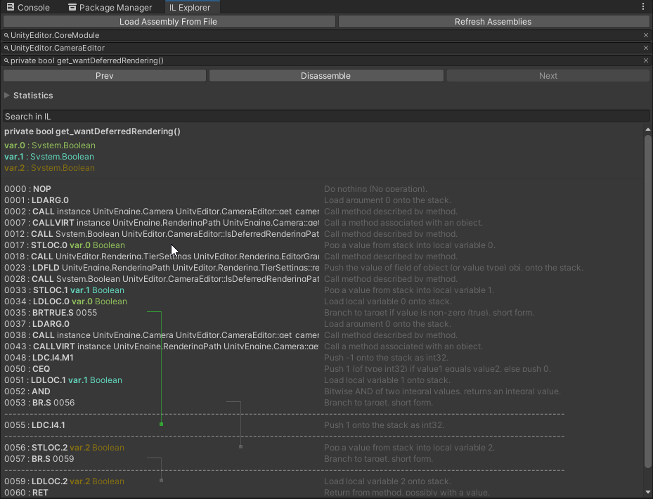

# IL Explorer 🔬

Utility window to view Intermediate Language (IL) for any type in Unity Project

## How To Use 💡
Please open the <a href="https://github.com/needle-tools/il-explorer/blob/main/package/Readme.md">Package Readme</a> for more information.

## Please Note ⚠️
This project is not actively maintained. Use at own risk. Pull Requests are welcome.

## Support 💚
If you find our free public tools useful please consider supporting development by becoming a  [patreon](https://www.patreon.com/needletools)

## Contact ✒️
<b>[🌵 needle — tools for unity](https://needle.tools)</b> • 
[@NeedleTools](https://twitter.com/NeedleTools) • 
[@marcel_wiessler](https://twitter.com/marcel_wiessler) • 
[@hybridherbst](https://twitter.com/hybridherbst)

